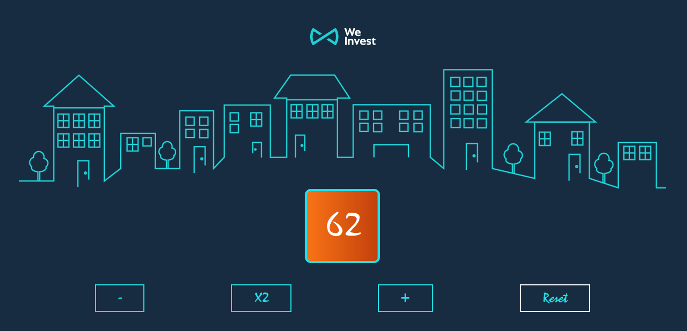

# Technical test | Front-end intern

This technical test is meant for "Front-end intern" candidates.

## Preview

## Objectives

-  Build this application by using this stack:
   - React.js
   - TailwindCSS
-  Your app should contains, at least, 2 components (One is already define)
-  You must achieve it in less than 2 hours

## Tasks
- [ ] Create a git repo 
- [ ] Show a counter in the middle of the page, with 0 as default value
- [ ] Increment the counter by 10 when the component is mount
- [ ] Make a button that increments the counter by 1
- [ ] Make a button that decrements the counter by 1
- [ ] Make a button that multiply the counter by 2
- [ ] Make a button that reset the counter to 0
- [ ] Let your imagination run wild and make a nice design with TailwindCSS
- [ ] EXTRA: Convert the app in TypeScript

